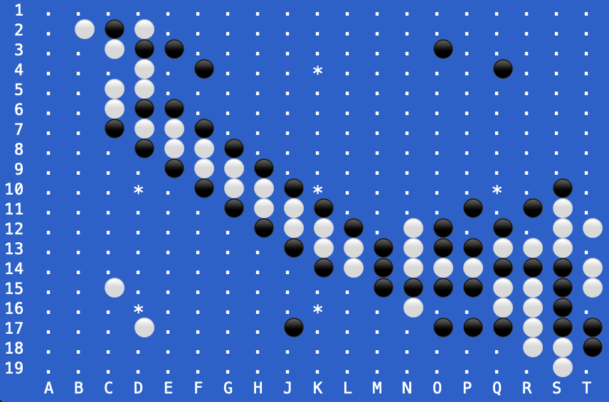

.. Sente documentation master file, created by
   sphinx-quickstart on Tue Jul 13 14:00:48 2021.
   You can adapt this file completely to your liking, but it should at least
   contain the root `toctree` directive.

Sente
=====

Sente (from the Japanese せんて/先手) is a general-purpose open-source python library for the ancient asian board game Go/Badok/Weiqi.
Sente is designed to be a Python 3 replacement for the `gomill <https://github.com/mattheww/gomill>`_ library.

Installation
============

Sente runs on any operating system with python 3.x and can be installed via pip.

.. code-block:: bash

    $ pip install sente

-- or --

.. code-block:: bash

    $ python3 -m install sente

Docs
====

.. toctree::
   :maxdepth: 2
   :caption: Tutorial

   tutorial/basics
   tutorial/game tree navigation
   tutorial/sgf
   tutorial/gotchas

.. toctree::
   :maxdepth: 2
   :caption: Library Reference

   basic components
   modules/sgf
   modules/exceptions

Indices and tables
==================

* :ref:`genindex`
* :ref:`modindex`
* :ref:`search`
